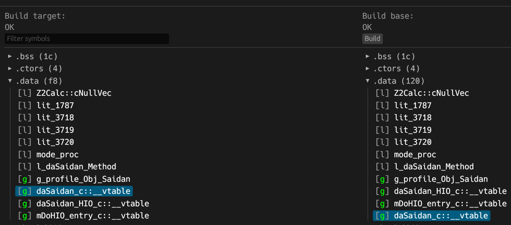
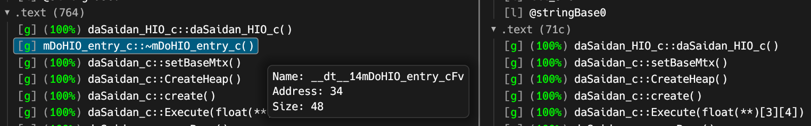
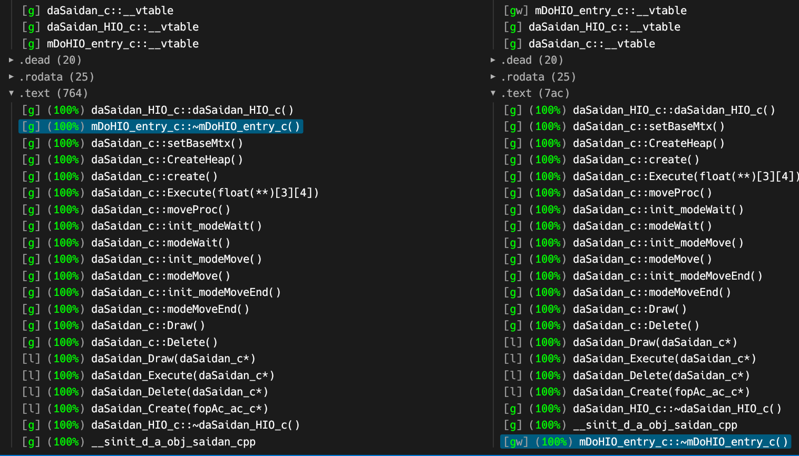
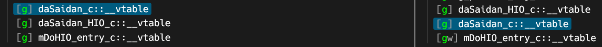
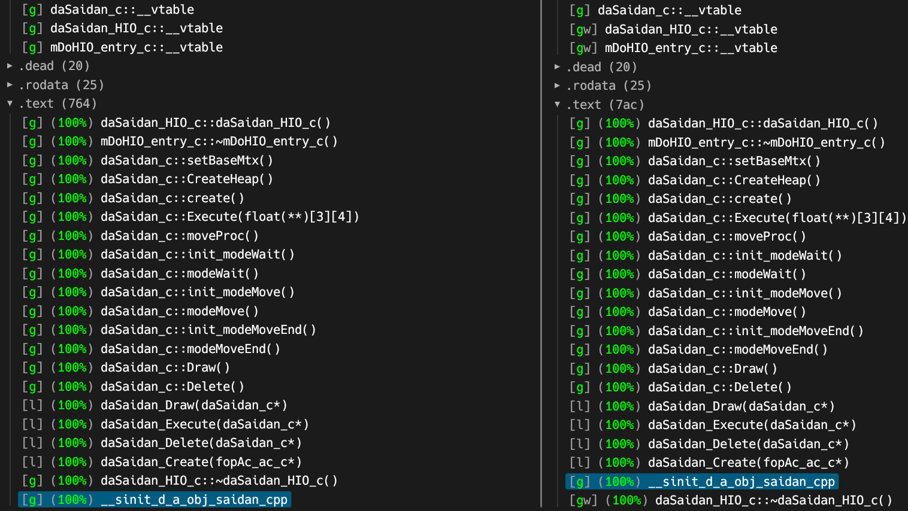

# Beginning TP Actor Decompilation: A Guided Example

## Introduction

This tutorial will guide you through the decompilation of a simple actor class in Zelda: Twilight Princess. The goal is to demonstrate what the process looks like from start to finish using a real example from the game, to impart some knowledge about common patterns used in the code, and teach some basic decompilation strategies and techniques that can be used in your own decompilation journey.

## Before you begin

A basic understanding of C++ will be beneficial to get the most out of this guide. If you intend to follow along, make sure you've read through the [onboarding docs](https://zsrtp.link/contribute) and can build the source code successfully.

It's important to keep in mind that while many share common patterns and similarities, each actor is different. What may work as a strategy in one may not in another. Decompiling heavily optimized C++ code can be a complex and nuanced process, with dependencies that may not be resolved until part or even all of the [Translation Unit](https://en.wikipedia.org/wiki/Translation_unit_(programming)) (TU) is fully decompiled.

Rather that treat the steps outlined by this guide as a universal strategy which can be applied to any actor, consider it more as a set of loose guidelines that can be used when approaching a new actor.

With the preamble out of the way, let's begin!

## Starting out

This guide will focus on the d_a_obj_saidan actor, which is considered a `rel`. For context, this actor represents the movable altar you find in the sanctuary at Kakariko village. Let's briefly go over some terminology here:

* Actor: An entity within the game world. This can be an object, the player, an enemy, an npc, or even just a piece of logic. Always extends from the `fopAc_ac_c` base actor class somewhere in the inheritance chain, but there are a few different subclasses of this. We'll explore one of them in this guide.
* rel: Each actor is represented as a piece of executable code called a "rel". These can be swapped in an out of memory as needed, like [overlays](https://en.wikipedia.org/wiki/Overlay_(programming)).

For those who prefer to follow along, the full path is `rel/d/a/obj/d_a_obj_saidan/d_a_obj_saidan.cpp`.

## Anatomy of an actor TU

All files that have not yet been decomped follow a similar structure which were autogenerated by a tool called `dol2asm`.

<details>
<summary>Click to see the file contents</summary>

```C++
//
// Generated By: dol2asm
// Translation Unit: d_a_obj_saidan
//

#include "rel/d/a/obj/d_a_obj_saidan/d_a_obj_saidan.h"
#include "dol2asm.h"
#include "global.h"

//
// Types:
//

struct request_of_phase_process_class {};

struct mDoMtx_stack_c {
    static u8 now[48];
};

struct mDoHIO_entry_c {
    /* 80CC3DE0 */ ~mDoHIO_entry_c();
};

struct fopAc_ac_c {};

struct daSaidan_c {
    /* 80CC3E28 */ void setBaseMtx();
    /* 80CC3EB0 */ void CreateHeap();
    /* 80CC3F1C */ void create();
    /* 80CC4054 */ void Execute(f32 (**)[3][4]);
    /* 80CC40A4 */ void moveProc();
    /* 80CC4148 */ void init_modeWait();
    /* 80CC4154 */ void modeWait();
    /* 80CC41B0 */ void init_modeMove();
    /* 80CC41BC */ void modeMove();
    /* 80CC4290 */ void init_modeMoveEnd();
    /* 80CC4314 */ void modeMoveEnd();
    /* 80CC4318 */ void Draw();
    /* 80CC43BC */ void Delete();
};

struct daSaidan_HIO_c {
    /* 80CC3DAC */ daSaidan_HIO_c();
    /* 80CC4478 */ ~daSaidan_HIO_c();
};

struct dSv_info_c {
    /* 80035360 */ void isSwitch(int, int) const;
};

struct dKy_tevstr_c {};

struct J3DModelData {};

struct cXyz {};

struct dScnKy_env_light_c {
    /* 801A37C4 */ void settingTevStruct(int, cXyz*, dKy_tevstr_c*);
    /* 801A4DA0 */ void setLightTevColorType_MAJI(J3DModelData*, dKy_tevstr_c*);
};

struct dRes_info_c {};

struct dRes_control_c {
    /* 8003C2EC */ void getRes(char const*, s32, dRes_info_c*, int);
};

struct dBgW {};

struct cBgS_PolyInfo {};

struct csXyz {};

struct dBgS_MoveBgActor {
    /* 80078624 */ dBgS_MoveBgActor();
    /* 80078690 */ bool Create();
    /* 800786B0 */ bool IsDelete();
    /* 800786B8 */ bool ToFore();
    /* 800786C0 */ bool ToBack();
    /* 800787BC */ void MoveBGCreate(char const*, int,
                                     void (*)(dBgW*, void*, cBgS_PolyInfo const&, bool, cXyz*,
                                              csXyz*, csXyz*),
                                     u32, f32 (*)[3][4]);
    /* 800788DC */ void MoveBGDelete();
    /* 80078950 */ void MoveBGExecute();
};

struct JAISoundID {};

struct Vec {};

struct Z2SeMgr {
    /* 802AB984 */ void seStart(JAISoundID, Vec const*, u32, s8, f32, f32, f32, f32, u8);
    /* 802AC50C */ void seStartLevel(JAISoundID, Vec const*, u32, s8, f32, f32, f32, f32, u8);
};

struct Z2AudioMgr {
    static u8 mAudioMgrPtr[4 + 4 /* padding */];
};

struct J3DModel {};

//
// Forward References:
//

extern "C" void __ct__14daSaidan_HIO_cFv();
extern "C" void __dt__14mDoHIO_entry_cFv();
extern "C" void setBaseMtx__10daSaidan_cFv();
extern "C" void CreateHeap__10daSaidan_cFv();
extern "C" void create__10daSaidan_cFv();
extern "C" void Execute__10daSaidan_cFPPA3_A4_f();
extern "C" void moveProc__10daSaidan_cFv();
extern "C" void init_modeWait__10daSaidan_cFv();
extern "C" void modeWait__10daSaidan_cFv();
extern "C" void init_modeMove__10daSaidan_cFv();
extern "C" void modeMove__10daSaidan_cFv();
extern "C" void init_modeMoveEnd__10daSaidan_cFv();
extern "C" void modeMoveEnd__10daSaidan_cFv();
extern "C" void Draw__10daSaidan_cFv();
extern "C" void Delete__10daSaidan_cFv();
extern "C" static void daSaidan_Draw__FP10daSaidan_c();
extern "C" static void daSaidan_Execute__FP10daSaidan_c();
extern "C" static void daSaidan_Delete__FP10daSaidan_c();
extern "C" static void daSaidan_Create__FP10fopAc_ac_c();
extern "C" void __dt__14daSaidan_HIO_cFv();
extern "C" void __sinit_d_a_obj_saidan_cpp();
extern "C" extern char const* const d_a_obj_saidan__stringBase0;

//
// External References:
//

extern "C" void mDoMtx_ZXYrotM__FPA4_fsss();
extern "C" void mDoExt_modelUpdateDL__FP8J3DModel();
extern "C" void mDoExt_J3DModel__create__FP12J3DModelDataUlUl();
extern "C" void fopAcM_setCullSizeBox2__FP10fopAc_ac_cP12J3DModelData();
extern "C" void dComIfG_resLoad__FP30request_of_phase_process_classPCc();
extern "C" void dComIfG_resDelete__FP30request_of_phase_process_classPCc();
extern "C" void dComIfGp_getReverb__Fi();
extern "C" void isSwitch__10dSv_info_cCFii();
extern "C" void getRes__14dRes_control_cFPCclP11dRes_info_ci();
extern "C" void dBgS_MoveBGProc_TypicalRotY__FP4dBgWPvRC13cBgS_PolyInfobP4cXyzP5csXyzP5csXyz();
extern "C" void __ct__16dBgS_MoveBgActorFv();
extern "C" bool Create__16dBgS_MoveBgActorFv();
extern "C" bool IsDelete__16dBgS_MoveBgActorFv();
extern "C" bool ToFore__16dBgS_MoveBgActorFv();
extern "C" bool ToBack__16dBgS_MoveBgActorFv();
extern "C" void
MoveBGCreate__16dBgS_MoveBgActorFPCciPFP4dBgWPvRC13cBgS_PolyInfobP4cXyzP5csXyzP5csXyz_vUlPA3_A4_f();
extern "C" void MoveBGDelete__16dBgS_MoveBgActorFv();
extern "C" void MoveBGExecute__16dBgS_MoveBgActorFv();
extern "C" void settingTevStruct__18dScnKy_env_light_cFiP4cXyzP12dKy_tevstr_c();
extern "C" void setLightTevColorType_MAJI__18dScnKy_env_light_cFP12J3DModelDataP12dKy_tevstr_c();
extern "C" void cLib_addCalc__FPfffff();
extern "C" void seStart__7Z2SeMgrF10JAISoundIDPC3VecUlScffffUc();
extern "C" void seStartLevel__7Z2SeMgrF10JAISoundIDPC3VecUlScffffUc();
extern "C" void __dl__FPv();
extern "C" void PSMTXCopy();
extern "C" void PSMTXTrans();
extern "C" void __ptmf_scall();
extern "C" extern void* g_fopAc_Method[8];
extern "C" extern void* g_fpcLf_Method[5 + 1 /* padding */];
extern "C" u8 now__14mDoMtx_stack_c[48];
extern "C" extern u8 g_dComIfG_gameInfo[122384];
extern "C" extern u8 g_env_light[4880];
extern "C" extern u8 j3dSys[284];
extern "C" u8 mAudioMgrPtr__10Z2AudioMgr[4 + 4 /* padding */];
extern "C" void __register_global_object();

//
// Declarations:
//

/* ############################################################################################## */
/* 80CC4524-80CC4528 000000 0004+00 2/2 0/0 0/0 .rodata          @3625 */
SECTION_RODATA static f32 const lit_3625 = 2.0f;
COMPILER_STRIP_GATE(0x80CC4524, &lit_3625);

/* 80CC4528-80CC452C 000004 0004+00 1/1 0/0 0/0 .rodata          @3626 */
SECTION_RODATA static f32 const lit_3626 = 250.0f;
COMPILER_STRIP_GATE(0x80CC4528, &lit_3626);

/* 80CC454C-80CC4558 000000 000C+00 1/1 0/0 0/0 .data            cNullVec__6Z2Calc */
SECTION_DATA static u8 cNullVec__6Z2Calc[12] = {
    0x00, 0x00, 0x00, 0x00, 0x00, 0x00, 0x00, 0x00, 0x00, 0x00, 0x00, 0x00,
};

/* 80CC4558-80CC456C 00000C 0004+10 0/0 0/0 0/0 .data            @1787 */
#pragma push
#pragma force_active on
SECTION_DATA static u32 lit_1787[1 + 4 /* padding */] = {
    0x02000201,
    /* padding */
    0x40080000,
    0x00000000,
    0x3FE00000,
    0x00000000,
};
#pragma pop

/* 80CC456C-80CC4578 -00001 000C+00 0/1 0/0 0/0 .data            @3718 */
#pragma push
#pragma force_active on
SECTION_DATA static void* lit_3718[3] = {
    (void*)NULL,
    (void*)0xFFFFFFFF,
    (void*)modeWait__10daSaidan_cFv,
};
#pragma pop

/* 80CC4578-80CC4584 -00001 000C+00 0/1 0/0 0/0 .data            @3719 */
#pragma push
#pragma force_active on
SECTION_DATA static void* lit_3719[3] = {
    (void*)NULL,
    (void*)0xFFFFFFFF,
    (void*)modeMove__10daSaidan_cFv,
};
#pragma pop

/* 80CC4584-80CC4590 -00001 000C+00 0/1 0/0 0/0 .data            @3720 */
#pragma push
#pragma force_active on
SECTION_DATA static void* lit_3720[3] = {
    (void*)NULL,
    (void*)0xFFFFFFFF,
    (void*)modeMoveEnd__10daSaidan_cFv,
};
#pragma pop

/* 80CC4590-80CC45B4 000044 0024+00 0/1 0/0 0/0 .data            mode_proc$3717 */
#pragma push
#pragma force_active on
SECTION_DATA static u8 mode_proc[36] = {
    0x00, 0x00, 0x00, 0x00, 0x00, 0x00, 0x00, 0x00, 0x00, 0x00, 0x00, 0x00,
    0x00, 0x00, 0x00, 0x00, 0x00, 0x00, 0x00, 0x00, 0x00, 0x00, 0x00, 0x00,
    0x00, 0x00, 0x00, 0x00, 0x00, 0x00, 0x00, 0x00, 0x00, 0x00, 0x00, 0x00,
};
#pragma pop

/* 80CC45B4-80CC45D4 -00001 0020+00 1/0 0/0 0/0 .data            l_daSaidan_Method */
SECTION_DATA static void* l_daSaidan_Method[8] = {
    (void*)daSaidan_Create__FP10fopAc_ac_c,
    (void*)daSaidan_Delete__FP10daSaidan_c,
    (void*)daSaidan_Execute__FP10daSaidan_c,
    (void*)NULL,
    (void*)daSaidan_Draw__FP10daSaidan_c,
    (void*)NULL,
    (void*)NULL,
    (void*)NULL,
};

/* 80CC45D4-80CC4604 -00001 0030+00 0/0 0/0 1/0 .data            g_profile_Obj_Saidan */
SECTION_DATA extern void* g_profile_Obj_Saidan[12] = {
    (void*)0xFFFFFFFD, (void*)0x0003FFFD,
    (void*)0x00400000, (void*)&g_fpcLf_Method,
    (void*)0x000005B4, (void*)NULL,
    (void*)NULL,       (void*)&g_fopAc_Method,
    (void*)0x01FC0000, (void*)&l_daSaidan_Method,
    (void*)0x00040000, (void*)0x000E0000,
};

/* 80CC4604-80CC462C 0000B8 0028+00 1/1 0/0 0/0 .data            __vt__10daSaidan_c */
SECTION_DATA extern void* __vt__10daSaidan_c[10] = {
    (void*)NULL /* RTTI */,
    (void*)NULL,
    (void*)CreateHeap__10daSaidan_cFv,
    (void*)Create__16dBgS_MoveBgActorFv,
    (void*)Execute__10daSaidan_cFPPA3_A4_f,
    (void*)Draw__10daSaidan_cFv,
    (void*)Delete__10daSaidan_cFv,
    (void*)IsDelete__16dBgS_MoveBgActorFv,
    (void*)ToFore__16dBgS_MoveBgActorFv,
    (void*)ToBack__16dBgS_MoveBgActorFv,
};

/* 80CC462C-80CC4638 0000E0 000C+00 2/2 0/0 0/0 .data            __vt__14daSaidan_HIO_c */
SECTION_DATA extern void* __vt__14daSaidan_HIO_c[3] = {
    (void*)NULL /* RTTI */,
    (void*)NULL,
    (void*)__dt__14daSaidan_HIO_cFv,
};

/* 80CC4638-80CC4644 0000EC 000C+00 3/3 0/0 0/0 .data            __vt__14mDoHIO_entry_c */
SECTION_DATA extern void* __vt__14mDoHIO_entry_c[3] = {
    (void*)NULL /* RTTI */,
    (void*)NULL,
    (void*)__dt__14mDoHIO_entry_cFv,
};

/* 80CC3DAC-80CC3DE0 0000EC 0034+00 1/1 0/0 0/0 .text            __ct__14daSaidan_HIO_cFv */
#pragma push
#pragma optimization_level 0
#pragma optimizewithasm off
asm daSaidan_HIO_c::daSaidan_HIO_c() {
    nofralloc
#include "asm/rel/d/a/obj/d_a_obj_saidan/d_a_obj_saidan/__ct__14daSaidan_HIO_cFv.s"
}
#pragma pop

/* 80CC3DE0-80CC3E28 000120 0048+00 1/0 0/0 0/0 .text            __dt__14mDoHIO_entry_cFv */
#pragma push
#pragma optimization_level 0
#pragma optimizewithasm off
asm mDoHIO_entry_c::~mDoHIO_entry_c() {
    nofralloc
#include "asm/rel/d/a/obj/d_a_obj_saidan/d_a_obj_saidan/__dt__14mDoHIO_entry_cFv.s"
}
#pragma pop

/* 80CC3E28-80CC3EB0 000168 0088+00 2/2 0/0 0/0 .text            setBaseMtx__10daSaidan_cFv */
#pragma push
#pragma optimization_level 0
#pragma optimizewithasm off
asm void daSaidan_c::setBaseMtx() {
    nofralloc
#include "asm/rel/d/a/obj/d_a_obj_saidan/d_a_obj_saidan/setBaseMtx__10daSaidan_cFv.s"
}
#pragma pop

/* ############################################################################################## */
/* 80CC4540-80CC4540 00001C 0000+00 0/0 0/0 0/0 .rodata          @stringBase0 */
#pragma push
#pragma force_active on
SECTION_DEAD static char const* const stringBase_80CC4540 = "H_Saidan";
#pragma pop

/* 80CC3EB0-80CC3F1C 0001F0 006C+00 1/0 0/0 0/0 .text            CreateHeap__10daSaidan_cFv */
#pragma push
#pragma optimization_level 0
#pragma optimizewithasm off
asm void daSaidan_c::CreateHeap() {
    nofralloc
#include "asm/rel/d/a/obj/d_a_obj_saidan/d_a_obj_saidan/CreateHeap__10daSaidan_cFv.s"
}
#pragma pop

/* ############################################################################################## */
/* 80CC4650-80CC465C 000008 000C+00 1/1 0/0 0/0 .bss             @3619 */
static u8 lit_3619[12];

/* 80CC465C-80CC4668 000014 000C+00 3/3 0/0 0/0 .bss             l_HIO */
static u8 l_HIO[12];

/* 80CC3F1C-80CC4054 00025C 0138+00 1/1 0/0 0/0 .text            create__10daSaidan_cFv */
#pragma push
#pragma optimization_level 0
#pragma optimizewithasm off
asm void daSaidan_c::create() {
    nofralloc
#include "asm/rel/d/a/obj/d_a_obj_saidan/d_a_obj_saidan/create__10daSaidan_cFv.s"
}
#pragma pop

/* 80CC4054-80CC40A4 000394 0050+00 1/0 0/0 0/0 .text            Execute__10daSaidan_cFPPA3_A4_f */
#pragma push
#pragma optimization_level 0
#pragma optimizewithasm off
asm void daSaidan_c::Execute(f32 (**param_0)[3][4]) {
    nofralloc
#include "asm/rel/d/a/obj/d_a_obj_saidan/d_a_obj_saidan/Execute__10daSaidan_cFPPA3_A4_f.s"
}
#pragma pop

/* ############################################################################################## */
/* 80CC4668-80CC466C 000020 0004+00 1/1 0/0 0/0 .bss             None */
static u8 data_80CC4668[4];

/* 80CC40A4-80CC4148 0003E4 00A4+00 1/1 0/0 0/0 .text            moveProc__10daSaidan_cFv */
#pragma push
#pragma optimization_level 0
#pragma optimizewithasm off
asm void daSaidan_c::moveProc() {
    nofralloc
#include "asm/rel/d/a/obj/d_a_obj_saidan/d_a_obj_saidan/moveProc__10daSaidan_cFv.s"
}
#pragma pop

/* 80CC4148-80CC4154 000488 000C+00 1/1 0/0 0/0 .text            init_modeWait__10daSaidan_cFv */
#pragma push
#pragma optimization_level 0
#pragma optimizewithasm off
asm void daSaidan_c::init_modeWait() {
    nofralloc
#include "asm/rel/d/a/obj/d_a_obj_saidan/d_a_obj_saidan/init_modeWait__10daSaidan_cFv.s"
}
#pragma pop

/* 80CC4154-80CC41B0 000494 005C+00 1/0 0/0 0/0 .text            modeWait__10daSaidan_cFv */
#pragma push
#pragma optimization_level 0
#pragma optimizewithasm off
asm void daSaidan_c::modeWait() {
    nofralloc
#include "asm/rel/d/a/obj/d_a_obj_saidan/d_a_obj_saidan/modeWait__10daSaidan_cFv.s"
}
#pragma pop

/* 80CC41B0-80CC41BC 0004F0 000C+00 1/1 0/0 0/0 .text            init_modeMove__10daSaidan_cFv */
#pragma push
#pragma optimization_level 0
#pragma optimizewithasm off
asm void daSaidan_c::init_modeMove() {
    nofralloc
#include "asm/rel/d/a/obj/d_a_obj_saidan/d_a_obj_saidan/init_modeMove__10daSaidan_cFv.s"
}
#pragma pop

/* ############################################################################################## */
/* 80CC452C-80CC4530 000008 0004+00 0/1 0/0 0/0 .rodata          @3758 */
#pragma push
#pragma force_active on
SECTION_RODATA static f32 const lit_3758 = 1.0f / 5.0f;
COMPILER_STRIP_GATE(0x80CC452C, &lit_3758);
#pragma pop

/* 80CC4530-80CC4534 00000C 0004+00 0/1 0/0 0/0 .rodata          @3759 */
#pragma push
#pragma force_active on
SECTION_RODATA static f32 const lit_3759 = 0.5f;
COMPILER_STRIP_GATE(0x80CC4530, &lit_3759);
#pragma pop

/* 80CC4534-80CC4538 000010 0004+00 1/2 0/0 0/0 .rodata          @3760 */
SECTION_RODATA static f32 const lit_3760 = 1.0f;
COMPILER_STRIP_GATE(0x80CC4534, &lit_3760);

/* 80CC4538-80CC453C 000014 0004+00 1/2 0/0 0/0 .rodata          @3761 */
SECTION_RODATA static f32 const lit_3761 = -1.0f;
COMPILER_STRIP_GATE(0x80CC4538, &lit_3761);

/* 80CC453C-80CC4540 000018 0004+00 0/1 0/0 0/0 .rodata          @3762 */
#pragma push
#pragma force_active on
SECTION_RODATA static u8 const lit_3762[4] = {
    0x00,
    0x00,
    0x00,
    0x00,
};
COMPILER_STRIP_GATE(0x80CC453C, &lit_3762);
#pragma pop

/* 80CC41BC-80CC4290 0004FC 00D4+00 1/0 0/0 0/0 .text            modeMove__10daSaidan_cFv */
#pragma push
#pragma optimization_level 0
#pragma optimizewithasm off
asm void daSaidan_c::modeMove() {
    nofralloc
#include "asm/rel/d/a/obj/d_a_obj_saidan/d_a_obj_saidan/modeMove__10daSaidan_cFv.s"
}
#pragma pop

/* 80CC4290-80CC4314 0005D0 0084+00 2/2 0/0 0/0 .text            init_modeMoveEnd__10daSaidan_cFv */
#pragma push
#pragma optimization_level 0
#pragma optimizewithasm off
asm void daSaidan_c::init_modeMoveEnd() {
    nofralloc
#include "asm/rel/d/a/obj/d_a_obj_saidan/d_a_obj_saidan/init_modeMoveEnd__10daSaidan_cFv.s"
}
#pragma pop

/* 80CC4314-80CC4318 000654 0004+00 1/0 0/0 0/0 .text            modeMoveEnd__10daSaidan_cFv */
void daSaidan_c::modeMoveEnd() {
    /* empty function */
}

/* 80CC4318-80CC43BC 000658 00A4+00 1/0 0/0 0/0 .text            Draw__10daSaidan_cFv */
#pragma push
#pragma optimization_level 0
#pragma optimizewithasm off
asm void daSaidan_c::Draw() {
    nofralloc
#include "asm/rel/d/a/obj/d_a_obj_saidan/d_a_obj_saidan/Draw__10daSaidan_cFv.s"
}
#pragma pop

/* 80CC43BC-80CC43EC 0006FC 0030+00 1/0 0/0 0/0 .text            Delete__10daSaidan_cFv */
#pragma push
#pragma optimization_level 0
#pragma optimizewithasm off
asm void daSaidan_c::Delete() {
    nofralloc
#include "asm/rel/d/a/obj/d_a_obj_saidan/d_a_obj_saidan/Delete__10daSaidan_cFv.s"
}
#pragma pop

/* 80CC43EC-80CC4418 00072C 002C+00 1/0 0/0 0/0 .text            daSaidan_Draw__FP10daSaidan_c */
#pragma push
#pragma optimization_level 0
#pragma optimizewithasm off
static asm void daSaidan_Draw(daSaidan_c* param_0) {
    nofralloc
#include "asm/rel/d/a/obj/d_a_obj_saidan/d_a_obj_saidan/daSaidan_Draw__FP10daSaidan_c.s"
}
#pragma pop

/* 80CC4418-80CC4438 000758 0020+00 1/0 0/0 0/0 .text            daSaidan_Execute__FP10daSaidan_c */
#pragma push
#pragma optimization_level 0
#pragma optimizewithasm off
static asm void daSaidan_Execute(daSaidan_c* param_0) {
    nofralloc
#include "asm/rel/d/a/obj/d_a_obj_saidan/d_a_obj_saidan/daSaidan_Execute__FP10daSaidan_c.s"
}
#pragma pop

/* 80CC4438-80CC4458 000778 0020+00 1/0 0/0 0/0 .text            daSaidan_Delete__FP10daSaidan_c */
#pragma push
#pragma optimization_level 0
#pragma optimizewithasm off
static asm void daSaidan_Delete(daSaidan_c* param_0) {
    nofralloc
#include "asm/rel/d/a/obj/d_a_obj_saidan/d_a_obj_saidan/daSaidan_Delete__FP10daSaidan_c.s"
}
#pragma pop

/* 80CC4458-80CC4478 000798 0020+00 1/0 0/0 0/0 .text            daSaidan_Create__FP10fopAc_ac_c */
#pragma push
#pragma optimization_level 0
#pragma optimizewithasm off
static asm void daSaidan_Create(fopAc_ac_c* param_0) {
    nofralloc
#include "asm/rel/d/a/obj/d_a_obj_saidan/d_a_obj_saidan/daSaidan_Create__FP10fopAc_ac_c.s"
}
#pragma pop

/* 80CC4478-80CC44D4 0007B8 005C+00 2/1 0/0 0/0 .text            __dt__14daSaidan_HIO_cFv */
#pragma push
#pragma optimization_level 0
#pragma optimizewithasm off
asm daSaidan_HIO_c::~daSaidan_HIO_c() {
    nofralloc
#include "asm/rel/d/a/obj/d_a_obj_saidan/d_a_obj_saidan/__dt__14daSaidan_HIO_cFv.s"
}
#pragma pop

/* 80CC44D4-80CC4510 000814 003C+00 0/0 1/0 0/0 .text            __sinit_d_a_obj_saidan_cpp */
#pragma push
#pragma optimization_level 0
#pragma optimizewithasm off
asm void __sinit_d_a_obj_saidan_cpp() {
    nofralloc
#include "asm/rel/d/a/obj/d_a_obj_saidan/d_a_obj_saidan/__sinit_d_a_obj_saidan_cpp.s"
}
#pragma pop

#pragma push
#pragma force_active on
REGISTER_CTORS(0x80CC44D4, __sinit_d_a_obj_saidan_cpp);
#pragma pop

/* 80CC4540-80CC4540 00001C 0000+00 0/0 0/0 0/0 .rodata          @stringBase0 */
```

</details>

While it may look large and intimidating, this is actually a relatively small actor. Let's examine the main sections of the file:

* Includes: By default, only two headers are included. An empty header specific to the actor, and `dol2asm.h` which is needed for some special defines included by the tool. Additional headers may be included as we decompile more of the file.
* Types: Most of these types are just stubs needed for the TU to successfully compile against, and will be removed as you pull in the necessary header files.
* Forward references: These are the [mangled](https://en.wikipedia.org/wiki/Name_mangling) forward declarations for the symbols defined by the actor. They are necessary for the asm chunks to compile successfully. Can be removed once decomp is complete.
* External references: These are the mangled external references that are used by the class. Eventually these will all be removed, some sooner than others.
* Declarations: This is where things get interesting. This section can contain a mix of uninitialized static variables (`.bss`), mutable static data (`.data`), readonly static data (`.rodata`), and code (`.text`). We'll cover each one of these more in detail later on.

## How big is it?

A good starting point is determining the size of the class. There are a few ways to accomplish this, but fortunately for us, one of them towers above the rest in its simplicity. The original devs included technical information about each actor, and as you've probably guessed, the size is included as part of that data.

Find the symbol `g_profile_Obj_Saidan` and look at the fifth element of this array.

```C++
/* 80CC45D4-80CC4604 -00001 0030+00 0/0 0/0 1/0 .data            g_profile_Obj_Saidan */
SECTION_DATA extern void* g_profile_Obj_Saidan[12] = {
    (void*)0xFFFFFFFD, (void*)0x0003FFFD,
    (void*)0x00400000, (void*)&g_fpcLf_Method,
    (void*)0x000005B4, (void*)NULL,
    (void*)NULL,       (void*)&g_fopAc_Method,
    (void*)0x01FC0000, (void*)&l_daSaidan_Method,
    (void*)0x00040000, (void*)0x000E0000,
};
```

That `0x5B4` represents the total size. Don't worry about the rest of this data for now, we'll revisit it later. Let's add that to the class structure. Speaking of, what is the class name? If you glance through the file, there are two candidates: `daSaidan_c` and `daSaidan_HIO_c`. It's the former; the latter is a special type of companion class that accompanies some actor classes, which we will examine more in detail in a later section.

```C++
struct daSaidan_c {
    /* 80CC3E28 */ void setBaseMtx();
    // ...
    /* 80CC43BC */ void Delete();
}; // Size: 0x5B4

STATIC_ASSERT(sizeof(daSaidan_c) == 0x5B4);
```

In addition to the size comment after the actor definition, notice the `STATIC_ASSERT` we added. This is useful because it will fail to compile if the actor does not match the expected size, alerting us to any unexpected changes of the structure.

This will fail to compile right now because we haven't put any data in the class. We'll revisit this shortly.

## Determine the base class

The next step is to determine the base class of the actor. There are a few ways to do this, but one of the simpler methods involves looking at the [vtable](https://en.wikipedia.org/wiki/Virtual_method_table) for the actor. These symbols begin with `__vt__`, so look for a symbol named `__vt__10daSaidan_c`:

```C++
SECTION_DATA extern void* __vt__10daSaidan_c[10] = {
    (void*)NULL /* RTTI */,
    (void*)NULL,
    (void*)CreateHeap__10daSaidan_cFv,
    (void*)Create__16dBgS_MoveBgActorFv,
    (void*)Execute__10daSaidan_cFPPA3_A4_f,
    (void*)Draw__10daSaidan_cFv,
    (void*)Delete__10daSaidan_cFv,
    (void*)IsDelete__16dBgS_MoveBgActorFv,
    (void*)ToFore__16dBgS_MoveBgActorFv,
    (void*)ToBack__16dBgS_MoveBgActorFv,
};
```

A quick analysis of this table tells us that the base class could be something called `dBgS_MoveBgActor`. Let's take a peek at the definition of that class now in `
include/d/bg/d_bg_s_movebg_actor.h`.

```C++
class dBgS_MoveBgActor : public fopAc_ac_c {
public:
    /* 0x568 */ dBgW* mpBgW;
    /* 0x56C */ Mtx mBgMtx;

    /* 80078624 */ dBgS_MoveBgActor();
    /* 800786C8 */ int MoveBGCreateHeap();
    /* 800787BC */ int MoveBGCreate(char const* i_arcName, int i_dzb_id,
                                    MoveBGActor_SetFunc i_setFunc, u32 i_heapSize, Mtx* i_bgMtx);
    /* 800788DC */ int MoveBGDelete();
    /* 80078950 */ int MoveBGExecute();

    int MoveBGDraw() { return Draw(); }

    /* 80078688 */ virtual int CreateHeap();
    /* 80078690 */ virtual int Create();
    /* 80078698 */ virtual int Execute(Mtx**);
    /* 800786A0 */ virtual int Draw();
    /* 800786A8 */ virtual int Delete();
    /* 800786B0 */ virtual int IsDelete();
    /* 800786B8 */ virtual int ToFore();
    /* 800786C0 */ virtual int ToBack();
```

This class extends the base actor class `fopAc_ac_c`, so we're on the right track. Notice how all of the virtual methods line up with the ones in the actor's vtable? While we can't be 100% sure without some additional investigation (for instance, there may be additional base classes without virtual methods), we can be reasonably certain this is the base class. Let's change that now.

```C++
class daSaidan_c : public dBgS_MoveBgActor {
public:
    // ...
}
```

Be sure to include this header at the top of the file.

```C++
#include "rel/d/a/obj/d_a_obj_saidan/d_a_obj_saidan.h"
#include "d/bg/d_bg_s_movebg_actor.h"
#include "dol2asm.h"
```

Observant readers will also note that the signatures of all of these methods do not match the base class, and will fail to compile right now. Let's change those to match.

```C++
    /* 80CC3E28 */ void setBaseMtx();
    /* 80CC3EB0 */ virtual int CreateHeap();
    /* 80CC3F1C */ void create();
    /* 80CC4054 */ virtual int Execute(Mtx**);
    /* 80CC40A4 */ void moveProc();
    /* 80CC4148 */ void init_modeWait();
    /* 80CC4154 */ void modeWait();
    /* 80CC41B0 */ void init_modeMove();
    /* 80CC41BC */ void modeMove();
    /* 80CC4290 */ void init_modeMoveEnd();
    /* 80CC4314 */ void modeMoveEnd();
    /* 80CC4318 */ virtual int Draw();
    /* 80CC43BC */ virtual int Delete();
```

In addition to the `virtual` calls being added to the overridden methods, their return types have also changed to match the base class. Make sure to update the definitions of these methods throughout the rest of the class, including the forward declared signatures. Also note that the parameter of the `Execute` method changed from the auto-generated `f32 (**param_0)[3][4]` to the correct `Mtx**` type.

There are a handful of methods which all actors must implement, but they are not necessarily base methods. We'll go over these in a later section.

## Shaping the data

At this point, we can try compiling our actor with `make -j rels`. Don't worry if your output isn't exactly what is shown here, but it should be similar.

<details open>
<summary>Build Output</summary>

```log
[610] building build/dolzel2/rel/d/a/obj/d_a_obj_saidan/d_a_obj_saidan.o
### mwcceppc_modded.exe Compiler:
#    File: build\dolzel2\rel\d\a\obj\d_a_obj_saidan\d_a_obj_saidan.cpp
# --------------------------------------------------------------------
#      16: struct mDoMtx_stack_c {
#   Error:                       ^
#   struct/union/enum/class tag 'mDoMtx_stack_c' redefined
### mwcceppc_modded.exe Compiler:
#      24: struct fopAc_ac_c {};
#   Error:                   ^
#   struct/union/enum/class tag 'fopAc_ac_c' redefined
### mwcceppc_modded.exe Compiler:
#      43: typedef char   static_assertion_failed43[(sizeof(daSaidan_c) == 0x5B4) ? 1 : -1]
#   Error:                                                                                ^
#   illegal constant expression
### mwcceppc_modded.exe Compiler:
#      54: struct dKy_tevstr_c {};
#   Error:                     ^
#   struct/union/enum/class tag 'dKy_tevstr_c' redefined
### mwcceppc_modded.exe Compiler:
#      56: struct J3DModelData {};
#   Error:                     ^
#   struct/union/enum/class tag 'J3DModelData' redefined
#   Too many errors printed, aborting program

User break, cancelled...
make: *** [rel/d/a/obj/d_a_obj_saidan/Makefile:47: build/dolzel2/rel/d/a/obj/d_a_obj_saidan/d_a_obj_saidan.o] Error 2
```

</details>

A lot of errors here, but let's focus on one for now. Remember earlier how we said it wouldn't compile because our actor has no data in it? That static assertion is one of those errors. Inheriting the `dBgS_MoveBgActor` class brings the size up to 0x5A0 bytes, but that's just shy of the actor's expected size of 0x5B4.

Most, if not all, actors require a special type of class called `request_of_phase_process_class`. This is used as an internal state machine for resource management. It requires the `SSystem/SComponent/c_phase.h` header, so let's stick that with the rest.

```C++
#include "rel/d/a/obj/d_a_obj_saidan/d_a_obj_saidan.h"
#include "SSystem/SComponent/c_phase.h"
#include "d/bg/d_bg_s_movebg_actor.h"
#include "dol2asm.h"
```

Figuring out the missing data members is a bit outside the scope of this guide, but there are other guides that cover this aspect of decompilation. The gist of it involves using Ghidra and other static analysis tools to determine the location and type of the member fields. Once you determine what those are, fill them out in the class structure.

```C++
    /* 0x5A0 */ request_of_phase_process_class mPhaseReq;
    /* 0x5A8 */ J3DModel* mpModel;
    /* 0x5AC */ u8 field_0x5ac;
    /* 0x5AD */ u8 field_0x5ad;
    /* 0x5B0 */ f32 field_0x5b0;
}; // Size: 0x5B4
```

Run the build again to confirm the static assertion no longer triggers.

## Cleaning out the cruft

Continuing on, all of our remaining errors (so far, as the compiler settings at the time of writing limit errors to a max of 5 before aborting) look similar to the following.

```log
struct/union/enum/class tag 'cXyz' redefined
```

You may recall from an earlier section that most of these structures are stubs needed to allow the asm chunks to compile. As we pull in the headers that define the real types, these stubs are no longer needed.

When starting out, a safe approach is to remove these one at a time, then recompile and check the errors again. Over time, you'll gain an intuition of which headers pull in what types and can just nuke them en masse.

In the end, there should be 3 remaining types:

* `mDoHIO_entry_c` (We'll learn what this is soon)
* `daSaidan_c`
* `daSaidan_HIO_c`

Once all the type duplicates have been removed, you should see some errors similar to the following.

```log
### mwcceppc_modded.exe Compiler:
#     102: extern "C" void PSMTXTrans();
#   Error:                             ^
#   illegal function overloading
### mwcceppc_modded.exe Compiler:
#     104: extern "C" extern void* g_fopAc_Method[8];
#   Error:                                          ^
#   identifier 'g_fopAc_Method' redeclared
#   was declared as: 'actor_method_class'
#   now declared as: 'void *[8]'
```

Similar to the type redefinitions, including additional headers may pull in real methods or data which can conflict with the external references. These also need to go at this point.

Finally, after removing all of these duplicates it should at last compile and link successfully...

```log
[610] building build/dolzel2/rel/d/a/obj/d_a_obj_saidan/d_a_obj_saidan.o
[610] creating build/dolzel2/rel/d/a/obj/d_a_obj_saidan.plf
generating RELs from .plf
python3 tools/makerel.py build --string-table build/dolzel2/frameworkF.str @build/plf_files build/dolzel2/main.elf
./tp check --rels
--- Check
[21:02:49] ERROR    05DF0D30DA4A53C4C3477FADBCB6DA347C3F1276 3A0EA1E58CA531E2708951E13ECC787B4B110AA2 build/dolzel2/rel/d/a/obj/d_a_obj_saidan.rel                     tp.py:1222
                    (d_a_obj_saidan.rel)                                                                                                                                         
           ERROR    NO MATCH!                                                                                                                                           tp.py:450
    ERR
make: *** [Makefile:168: rels] Error 1
```

...with a no match error.

Whomp whomp.

In an ideal scenario, we would get an `OK` at this point, meaning the signature of our compiled code matches the ROM. However it's not unusual to get a mismatch, because even with the minimal changes we've made there are things the compiler does behind the scenes that could introduce differences.

## Our first vtable woes

We have more work to do, but what is causing the mismatch anyway? We haven't even begun the process of actually decompiling any code yet! At this point, let's introduce an incredibly useful tool called [objdiff](https://github.com/encounter/objdiff) to see if it can give us any clues about what is wrong.

Opening it up and comparing our results, we can notice a subtle difference in the `.data` section.



The vtable ordering is different! This does unfortunately matter when matching, and worse yet is we don't have any direct control over this. The compiler follows a heuristic when populating the `.data` section as it processes the TU, so we must ascertain how the code was originally written and match it. Inlining constructors/destructors can make a difference in the order, and since this involves these mysterious `HIO` classes, let's start with those.

## Heigh-HIO~!

HIO stands for Host IO, and it allowed the original devs to hook up their dev machines to the game hardware (devkits) to alter behavior while the game was running. It was a way of tuning various game parameters in real time, without the need to recompile and redeploy to the devkits, saving precious time.

Actors that interacted with the system would create a static instance of a class that inherits the base `mDoHIO_entry_c`. This can be confirmed by looking at the constructor asm for `` in ``

```as
lbl_80CC3DAC:
/* 80CC3DAC  3C 80 80 CC */ lis r4, __vt__14mDoHIO_entry_c@ha /* 0x80CC4638@ha */
/* 80CC3DB0  38 04 46 38 */ addi r0, r4, __vt__14mDoHIO_entry_c@l /* 0x80CC4638@l */
```

While we're at it, notice the destructor (begins with the `__dt__` prefix) in the vtable which indicates it should be virtual.

```C++
SECTION_DATA extern void* __vt__14daSaidan_HIO_c[3] = {
    (void*)NULL /* RTTI */,
    (void*)NULL,
    (void*)__dt__14daSaidan_HIO_cFv,
};
```

Let's go ahead and change both of those things now.

```C++
class daSaidan_HIO_c : public mDoHIO_entry_c {
public:
    /* 80CC3DAC */ daSaidan_HIO_c();
    /* 80CC4478 */ virtual ~daSaidan_HIO_c();
};
```

You'll also need to include the header `m_Do/m_Do_hostIO.h`.

```C++
#include "d/bg/d_bg_s_movebg_actor.h"
#include "m_Do/m_Do_hostIO.h"
#include "dol2asm.h"
```

Compiling at this point will introduce a new error.

```log
#     244: asm mDoHIO_entry_c::~mDoHIO_entry_c() {
#   Error:                                       ^
#   object 'mDoHIO_entry_c::~mDoHIO_entry_c()' redefined
```

So is this just another duplicate method that we can remove? Not quite. To understand why, we'll need to briefly cover what weak functions are and why the destructor of another class showed up to derail our decomp adventure in the first place.

## The weakest link

When the compiler generates multiple definitions of the same method across different TUs, these are referred to as "[weak functions](https://en.wikipedia.org/wiki/Weak_symbol)". It's the linker's job to resolve any duplicate definitions of these so-called weak functions, and the virtual destructor of the base `mDoHIO_entry_c` class is one such example of these. The compiler generates a copy of it of it in this TU because it's inlined in the base class.

While we've correctly established our inheritance structure for the HIO class, the destructor already has a definition so if we just remove this extra weak destructor as a way of resolving the error, the compiler won't generate a definition for it. This can be confirmed by commenting out the destructor, compiling, and then looking at the output in objdiff.



Notice how it's no longer present in the build? Whether this matters depends on the TU. A better way to resolve the conflict is to declare it as an `extern` using its mangled name, like so:

```C++
// asm mDoHIO_entry_c::~mDoHIO_entry_c() {
extern "C" asm void __dt__14mDoHIO_entry_cFv() {
    nofralloc
#include "asm/rel/d/a/obj/d_a_obj_saidan/d_a_obj_saidan/__dt__14mDoHIO_entry_cFv.s"
}
```

This strategy can be applied any time you encounter redefinition errors involving these types of weak functions. Just declare it as an extern and use the mangled name to avoid symbol name collisions with weak functions.

With this, we compile and link successfully and all functions are present and in the correct order (but the vtable ordering issues remain).

## Decompiling the first function

So what now? It seems like we're back where we started, but I promise we've made progress. Our HIO class now has the correct inheritance chain and we can begin to correct the vtable ordering. Let's start by adding an empty destructor to see if it matches the compiler generated asm.

```C++
#if NONMATCHING
daSaidan_HIO_c::~daSaidan_HIO_c() {}
#else
#pragma push
#pragma optimization_level 0
#pragma optimizewithasm off
asm daSaidan_HIO_c::~daSaidan_HIO_c() {
    nofralloc
#include "asm/rel/d/a/obj/d_a_obj_saidan/d_a_obj_saidan/__dt__14daSaidan_HIO_cFv.s"
}
#pragma pop
#endif
```

Notice the `NONMATCHING` define in there? It's a good idea to keep any in-progress work gated behind a define like this. Doing so opens the possibility of checking in partial work while still compiling with a match. It's a common pattern you'll find throughout the early code base, but will become rarer as we near completion. Make sure to add a define somewhere near the top.

```C++
#define NONMATCHING 1
```

Did that change anything? Let's recompile and take a look at objdiff.



Well, at least the empty constructor matches. But the vtable order hasn't changed, and now the base destructor of the HIO class is out of order to boot! While it seems like we may be moving in the wrong direction, similar to [sliding number puzzles](https://en.wikipedia.org/wiki/Sliding_puzzle), things often get more wrong before they get right. Next, let's take care of that constructor.

## Literally floating

Next, let's try disassembling the constructor. Looking at the Ghidra output, seems simple enough.

```C++
void __thiscall daSaidan_HIO_c::daSaidan_HIO_c(daSaidan_HIO_c *this)
{
  this->vtable = (uint32_t)&DAT_80cc4638;
  this->vtable = (uint32_t)&DAT_80cc462c;
  this->field1_0x4 = 2.0;
  this->field2_0x8 = 250.0;
  return;
}
```

Note that because there is a virtual destructor, this object needs a vtable. This happens to occupy the first four bytes in this case, so the first actual field member begins at offset `0x04`. Add those to the structure now.

```C++
class daSaidan_HIO_c : public mDoHIO_entry_c {
public:
    /* 80CC3DAC */ daSaidan_HIO_c();
    /* 80CC4478 */ virtual ~daSaidan_HIO_c();
    
    /* 0x00 vtable */
    /* 0x04 */ f32 field_0x04;
    /* 0x08 */ f32 field_0x08;
```

Ignoring the vtable assignment (the compiler will do this automatically), let's write the constructor definition. Make sure to specify the `f` suffix, otherwise the compiler will assume we're working with doubles.

```C++
#if NONMATCHING
daSaidan_HIO_c::daSaidan_HIO_c() {
    field_0x04 = 2.0f;
    field_0x08 = 250.0f;
}
#else
```

While this compiles and the generated instructions are correct, there is a problem. In PowerPC architecture (what the GC and Wii use), the floating point registers can generally only load from memory. This means that the compiler stores any floating point literals in the `.rodata` section. Looking up a bit, you can find the literals for these values. Let's try removing them now, so that the compiler can generate them for us.

```C++
#if !NONMATCHING
/* 80CC4524-80CC4528 000000 0004+00 2/2 0/0 0/0 .rodata          @3625 */
SECTION_RODATA static f32 const lit_3625 = 2.0f;
COMPILER_STRIP_GATE(0x80CC4524, &lit_3625);

/* 80CC4528-80CC452C 000004 0004+00 1/1 0/0 0/0 .rodata          @3626 */
SECTION_RODATA static f32 const lit_3626 = 250.0f;
COMPILER_STRIP_GATE(0x80CC4528, &lit_3626);
#endif
```

However, we run into errors if we compile now.

```log
#      10: /* 80CC41DC  3C 60 80 CC */ lis r3, lit_3625@ha /* 0x80CC4524@ha */ 
#   Error:                                                                    ^
#   illegal use of label (lit_3625), can only use label difference in this 
#   context
### mwcceppc_modded.exe Compiler:
#      11: /* 80CC41E0  3B E3 45 24 */ addi r31, r3, lit_3625@l /* 0x80CC4524@l */ 
#   Error:                                                                        ^
#   illegal use of label (lit_3625), can only use label difference in this 
#   context
```

This indicates that we can't remove these just yet because they are being used in other functions that haven't been compiled yet. The compiler will re-use float literals that have already been defined in the TU. It's more efficient of course, but makes decomp trickier.

So what do we do? We could just leave them in place until all functions that share them have been decompiled before finally removing them. We could also try to trick the compiler into using the existing literals by casting them to point directly to them, like so.

```C++
    field_0x04 = *((f32*)&lit_3625);
    field_0x08 = *((f32*)&lit_3626);
```

We can now remove the `NONMATCHING` guard block around this method as well as the `asm` definition. Just keep in mind we'll need to come back and fix this later once we are able to remove these literals after decompiling all functions that use them.

## At last, fixing the vtable order

If we look at the vtable ordering again after these changes, it looks different. However, the order still doesn't quite match up.



This is where things may require a bit of trial and error. Playing around with the function ordering or inlining certain methods can make a difference. Let's try inlining that destructor in the declaration now, making sure to remove the old definition.

```C++
    /* 80CC3DAC */ daSaidan_HIO_c();
    /* 80CC4478 */ virtual ~daSaidan_HIO_c() {}
```

It worked! The vtables are finally in the right order now.



But we're still getting a mismatch. What else could be going on? Now it looks like one of the functions in the `.text` section is out of order. What is this `__sinit_d_a_obj_saidan_cpp` method? Let's dive into the final piece of the puzzle in the next section.

## OK
